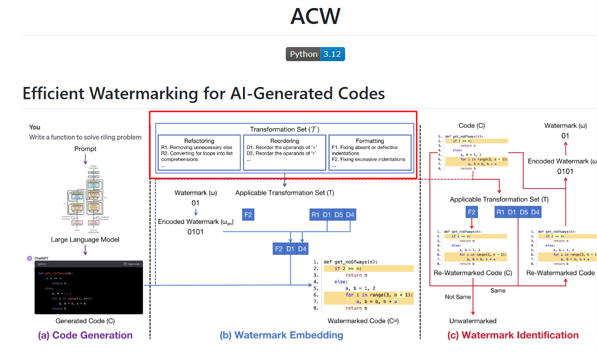
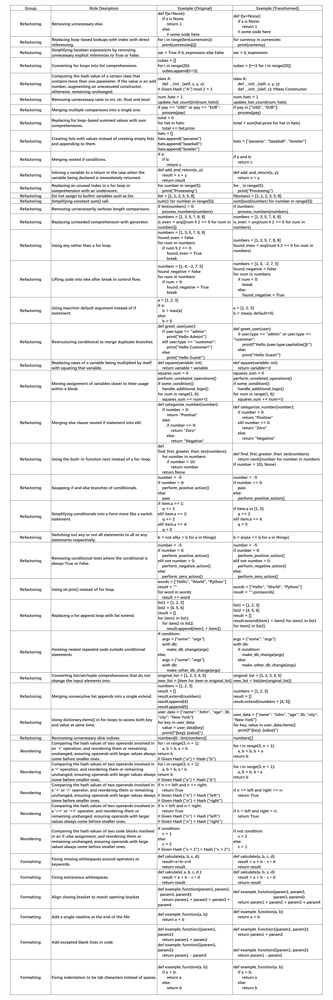

<h1 align="center">ACW</h1>

Efficient Watermarking for AI-Generated Codes

  
  

## Overview

The implementation of ACW involves the following processes: scanning the AI-generated code to identify code transformations applicable to code segments based on a set of rules. According to the corresponding bits for the model, appropriate rules from the available set are selected and applied to embed the watermark into the code.

## Appendix

If you need the complete list of rules, please download it [here](https://github.com/Noelle1831-k/ACW/blob/main/Transformations.xlsx)
