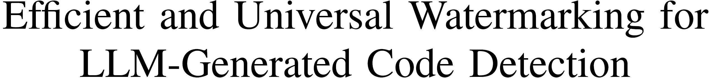
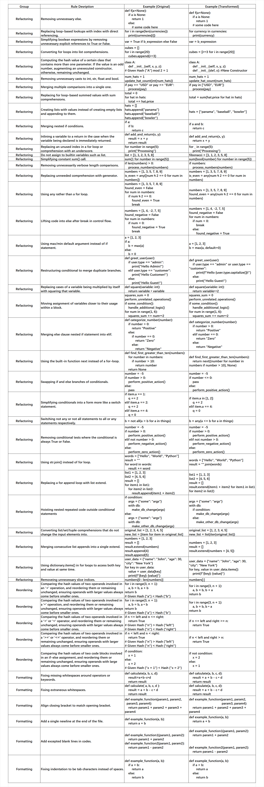
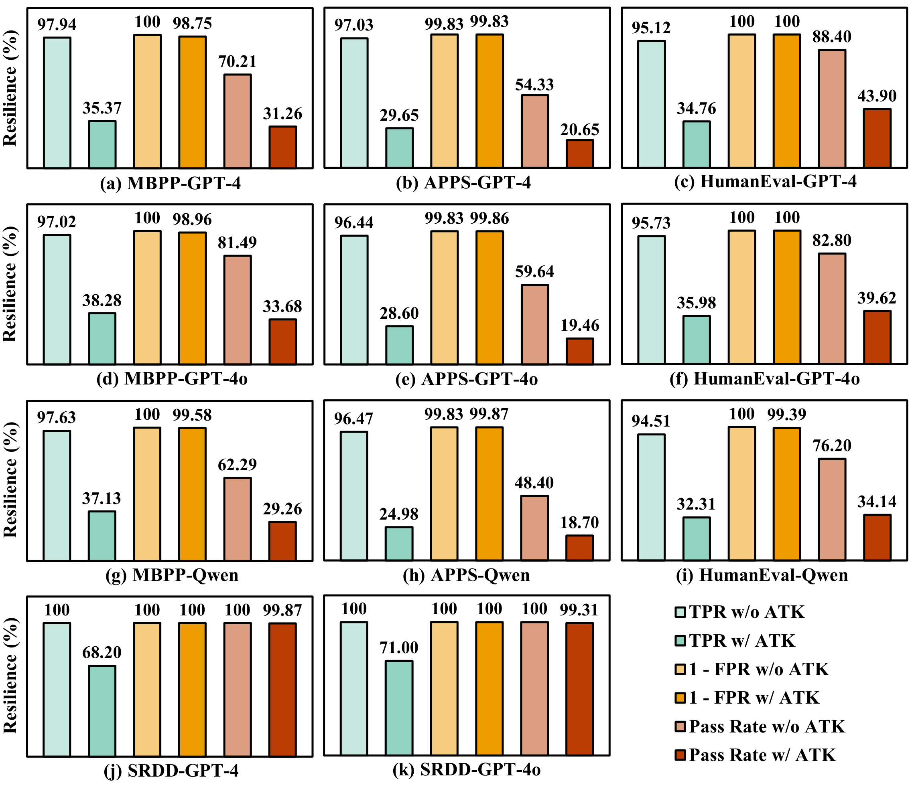

<p align="center">
     <a href="https://arxiv.org/abs/2402.07518">

     </a>
   <p align="center">
    <a><strong>Boquan Li<sup>1,2</sup></strong></a>
    .
    <a><strong>Zirui Fu<sup>1</sup></strong></a>
    .
    <a><strong>Mengdi Zhang<sup>2</sup></strong></a>
    .
    <a><strong>Peixin Zhang<sup>2</sup></strong></a>
    .
    <a><strong>Jun Sun<sup>2</sup></strong></a>
    .
    <a><strong>Xingmei Wang<sup>1</sup></strong></a>
   
    
<p align="center">
    <strong><sup>1</sup>Harbin Engineering University</strong> &nbsp;
    <strong><sup>2</sup>Singapore Management University</strong> &nbsp;
<p align="center">
    <a href='https://arxiv.org/abs/2402.07518'>
      
         </a>
  
## Overview of this repository
- [Abstract](#abstract)
- [Quick Start](#quick-start)
- [Appendix](#appendix)
    - [A.Transformation Rules](#atransformation-rules)
    - [B.Supplementary Experiments](#bsupplementary-experiments)
- [Contact](#contact)

## Abstract


Large language models (LLMs) have significantly enhanced the usability of AI-generated code, providing effective assistance to programmers. 
This advancement also raises ethical and legal concerns, such as academic dishonesty or the generation of malicious code.
For accountability, it is imperative to detect whether a piece of code is AI-generated.
Watermarking is broadly considered a promising solution and has been successfully applied to identify LLM-generated text. 
However, existing efforts on code are far from ideal, suffering from limited universality and excessive time and memory consumption.
In this work, we propose a plug-and-play watermarking approach for AI-generated code detection, named **ACW** (**A**I **C**ode **W**atermarking).
**ACW** is training-free and works by selectively applying a set of carefully-designed, semantic-preserving and idempotent code transformations to LLM code outputs.
The presence or absence of the transformations serves as implicit watermarks, enabling the detection of AI-generated code.
Our experimental results show that **ACW** effectively and efficiently detects AI-generated code, preserves code utility, and is resilient against potential code disruptions.
Especially, **ACW** is universal across different LLMs, addressing the limitations of existing approaches.

## Quick Start

### Step 1: Install Dependencies

Install the required Python libraries by running:

```bash
pip install -r requirements.txt
```

Login Sourcery API by running (please apply for a token on the [official Sourcery website](https://docs.sourcery.ai/Coding-Assistant/Guides/Getting-Started/CI/) if necessary):

```bash
sourcery login --token $SOURCERY_TOKEN
```

### Step 2: Prepare the Dataset

We have provided our complete experimental data containing AI-generated and human-written code. 
If additional data is necessary, please add the dataset path to the **folder_list.py** file, like this:

```python
folder_paths = ["G/Data"]
```

### Step 3: Test the Results

#### **Evaluation on Discriminability**

```bash
python RQ1-get-results.py
```

The results will be saved as _output.json_, containing the number of positive and negative examples for computation.

#### **Evaluation on Utility**

##### Pass Rate based on APPS

After setting up and downloading the APPS dataset as instructed on the [APPS project page](https://github.com/hendrycks/apps), 
testing the pass rate using the command:

```bash
python test_one_solution.py -r <code_dir> -t <test_dir> --save /path/to/save_dir --print_results
```

##### Pass Rate based on MBPP and HumanEval

First, please consolidate the code data into a JSONL file:

```bash
python folder_to_jsonl.py convert_py_folder_to_jsonl --input_folder=<code_dir>
```

After setting up as instructed on the [mxeval project page](https://github.com/amazon-science/mxeval), 
testing the pass rate using the command::

```bash
evaluate_functional_correctness <mbpp_data>.jsonl --problem_file data/mbxp/mbpp_release_v1.jsonl
evaluate_functional_correctness <humaneval_data>.jsonl --problem_file data/multilingual_humaneval/HumanEval.jsonl
```

#### **Evaluation on Resilience**

Running the following command for testing:

```bash
python RQ4-get-results.py folder_process --strength= <1 or 2>
```

Strength 1 and 2 correspond to the Default-level and Maximum-level modifications.

#### **Evaluation on Transformation Idempotence**

Running the following command for testing:

```bash
python refactor.py idempotence --type scan --output results_idempotence_scan.json
```

#### **Evaluation on Transformation Order**

Running the following command for testing:

```bash
python refactor.py idempotence --type random --seed 42 --output results_order_random.json
```

#### **Evaluation on Watermark Overlap**

Running the following command for testing:

```bash
python refactor.py chain --length 3 --seed 42 --output results_overlap.json
```

## Appendix

### A.Transformation Rules



### B.Supplementary Experiments

We additionally explore the resilience of **ACW** in an extreme setting, where an attacker aims to entirely and arbitrarily rewrite the internal logic and control structure of code, using ChatGPT-4 with the prompt: Rewrite the internal logic of the following Python code completely, including changes to the algorithms, control structures, and variable names. You must strictly preserve the function signature, including the function name, input arguments, and return types, and ensure that the functionality remains exactly the same.

<div align="center">
  
  <br>
  <b>Resilience results on rewrite attacks</b>
</div>

The above figure presents our results. As shown by the red columns in the charts, in terms of the pass rate degradations, the utility of most function-level code has been destroyed by the attack, indicating that excessive modifications result in invalid attacks beyond real-world threat models. This extreme setting serves as an upper-bound analysis, highlighting that watermark disruption attacks should be utility-preserving rather than arbitrarily modifying code at the expense of functionality.


## Contact
We are looking forward to any valuable questions or suggestions, please feel free to contact us at ```noelle@hrbeu.edu.cn```
